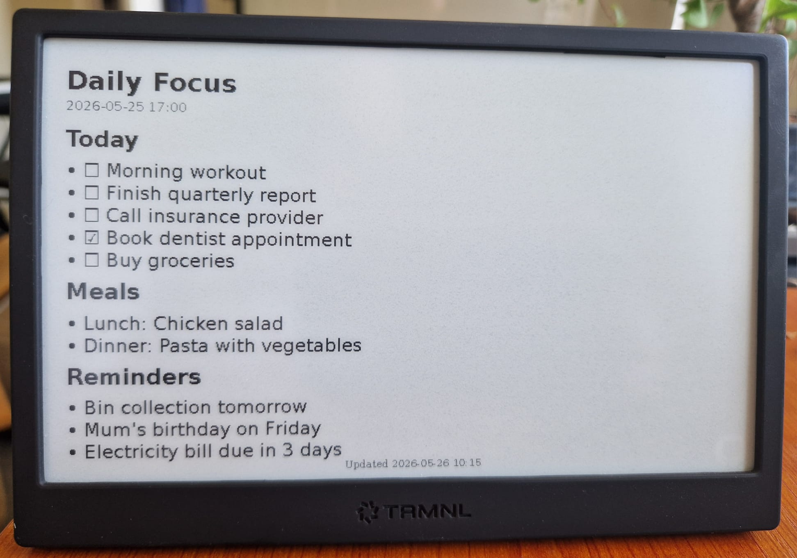

# Joplin TRMNL Push

Push Joplin search results to a [TRMNL](https://usetrmnl.com/) private plugin webhook.

A note such as this one:

```markdown
## Today

- [ ] Morning workout
- [ ] Finish quarterly report
- [ ] Call insurance provider
- [x] Book dentist appointment
- [ ] Buy groceries

## Meals

- Lunch: Chicken salad
- Dinner: Pasta with vegetables

## Reminders

- Bin collection tomorrow
- Mum's birthday on Friday
- Electricity bill due in 3 days
```

would render like so in the TRMNL device:



## Features

- Configure a Joplin search query to find matching notes
- Push results to TRMNL as merge variables
- Two display modes: list of notes, or single note with body
- Manual push via Tools menu command
- Optional periodic automatic push
- Configurable result limit
- Optional updated time for each note

## Installation

1. Search for "TRMNL Push" from Joplin
2. Install it
3. Follow the instruction below for setup

## TRMNL Setup

Before configuring the Joplin plugin, set up a Private Plugin on the TRMNL side:

1. Log into [usetrmnl.com](https://usetrmnl.com/) and go to **Plugins**.
2. Add a new **Private Plugin**.
3. Give it a name (e.g. "Joplin Search").
4. Set the **Strategy** to **Webhook** — TRMNL will generate a unique webhook URL.
5. Copy that URL — you'll paste it into the Joplin plugin settings below.
6. In the TRMNL plugin editor, paste the markup template (see [TRMNL Template](#trmnl-template) below). Merge variables become available once data has been pushed at least once.
7. After completing the Joplin configuration, run **Tools** > **Push search results to TRMNL** to send the first payload — this registers the variable schema with TRMNL so the merge variables become available in the template editor.
8. Add the plugin to a **Playlist** so it appears in your device's screen rotation.

See the [TRMNL Private Plugins documentation](https://docs.usetrmnl.com/go/private-plugins) for the canonical reference on the webhook strategy, payload shape, and Liquid templating.

## Configuration

Go to **Settings** > **TRMNL Push** and configure:

| Setting | Description |
|---------|-------------|
| TRMNL Webhook URL | The webhook URL from your TRMNL private plugin |
| Search Query | Joplin search query (e.g., `tag:todo type:note`) |
| Display Mode | `List of notes` (titles only) or `Single note (with body)` |
| Result Limit | Maximum number of notes to include in list mode (default: 5) |
| Push Interval | Automatic push interval in minutes (0 to disable) |
| Include Updated Time | Include last updated time for each note |

In **Single note** mode, the most recent matching note is sent with its body. `Result Limit` is ignored in this mode.

## Usage

Go to **Tools** > **Push search results to TRMNL** to push the current search results to your TRMNL device. Run this once after setting up your config to verify everything works and to register the merge variables with TRMNL.

## TRMNL Template

The plugin sends one of two payload shapes, depending on the **Display Mode** setting.

**List mode payload:**

```json
{
	"merge_variables": {
		"title": "Joplin Search",
		"query": "tag:todo type:note",
		"count": 3,
		"mode": "list",
		"items": [
			{ "title": "Review PR", "updated": "2026-03-13 09:20" },
			{ "title": "Release notes", "updated": "2026-03-12 18:05" }
		],
		"pushed_at": "2026-03-13 14:00"
	}
}
```

**Single-note mode payload:**

```json
{
	"merge_variables": {
		"title": "Joplin Search",
		"count": 1,
		"mode": "single",
		"items": [ { "title": "Review PR", "updated": "2026-03-13 09:20" } ],
		"note": {
			"title": "Review PR",
			"updated": "2026-03-13 09:20",
			"body": "Check the auth refactor...",
			"body_html": "<p>Check the <strong>auth refactor</strong>...</p>"
		},
		"pushed_at": "2026-03-13 14:00"
	}
}
```

`note.body` is the raw Markdown of the note. `note.body_html` is the note rendered to HTML — use this in your template so bold, italics, lists, checkboxes, and headings render properly on the device.

A few things to keep in mind:

- **Keep matched notes short.** Long notes are clipped to fit TRMNL's payload limit, ending with `…`.
- **Joplin attachment images won't display.** Use external HTTPS image URLs (``) for any images you want on the device.
- **Raw HTML in your notes is rendered as-is.** If you want fine-grained control over the layout of a specific note (custom spans, divs, inline styles), just write the HTML directly in the note.

The following template handles both display modes. Paste it into the **Markup** field of your Private Plugin's **Full** view:

```html
<style>
	.j-layout {
		padding: 16px;
		box-sizing: border-box;
		height: 100%;
		font-family: sans-serif;
		font-size: 20px;
	}
	.j-title { font-size: 1.4em; font-weight: bold; }
	.j-meta { font-size: 0.7em; opacity: 0.7; margin-top: 2px; }
	.j-list { margin-top: 0.6em; }
	.j-list-item { padding: 0.3em 0; border-bottom: 1px solid #000; }
	.j-list-item-title { font-weight: bold; }
	.j-list-item-meta { float: right; opacity: 0.7; }
	.j-footer {
		position: absolute;
		bottom: 0.4em;
		left: 0;
		right: 0;
		text-align: center;
		font-size: 0.7em;
		opacity: 0.6;
	}
	.j-body {
		margin-top: 0.6em;
		line-height: 1.35;
		h1 { font-size: 1.4em; margin: 0.3em 0; }
		h2 { font-size: 1.2em; margin: 0.3em 0; }
		h3 { font-size: 1.05em; margin: 0.3em 0; }
		h4, h5, h6 { font-size: 1em; margin: 0.3em 0; font-weight: bold; }
		ul, ol { padding-left: 0; list-style: none; }
		ul, ol { li::before { content: "• "; } }
		ul.cb-list { li::before { content: none; } }
		img { max-width: 100%; height: auto; }
	}
</style>

<div class="view view--full">
	<div class="j-layout">
		
			<div class="j-title">{{ note.title }}</div>
			
				<div class="j-meta">{{ note.updated }}</div>
			
			<div class="j-body">{{ note.body_html }}</div>
		
			<div class="j-title">{{ title }}</div>
			<div class="j-meta">{{ query }} • {{ count }} notes</div>
			<div class="j-list">
				
					<div class="j-list-item">
						<span class="j-list-item-title">{{ item.title }}</span>
						
							<span class="j-list-item-meta">{{ item.updated }}</span>
						
					</div>
				
			</div>
		
	</div>

	<div class="j-footer">Updated {{ pushed_at }}</div>
</div>
```

Tips for adjusting the template:

- Headings, paragraphs, lists, blockquotes, code blocks, and other Markdown elements are styled by TRMNL's built-in framework CSS — no extra rules needed for those.
- The minimal `<style>` block at the top handles two things the framework doesn't: hiding bullets on checkbox lists, and constraining image width.
- If you want to override spacing or font sizes, add rules to that `<style>` block targeting `.note-body p`, `.note-body h2`, etc.
- Checkboxes in your notes appear as `☐` (unchecked) and `☑` (checked) inline in list items.

### Compact layouts (half / quadrant)

TRMNL devices can mix multiple plugins on one screen, which uses smaller layouts: **Half horizontal**, **Half vertical**, and **Quadrant**. If you only use the Full layout you can skip these and ignore the "view not available" warnings. Otherwise, here are condensed templates for each.

**Half horizontal:**

```html
<style>
	.j-layout {
		padding: 12px;
		box-sizing: border-box;
		height: 100%;
		font-family: sans-serif;
		font-size: 16px;
	}
	.j-title { font-size: 1.4em; font-weight: bold; }
	.j-title-count { font-weight: normal; opacity: 0.7; }
	.j-list { margin-top: 0.4em; }
	.j-list-item { padding: 0.2em 0; font-size: 1.1em; }
	.j-body {
		margin-top: 0.4em;
		line-height: 1.3;
		max-height: 180px;
		overflow: hidden;
		h1 { font-size: 1.4em; margin: 0.25em 0; }
		h2 { font-size: 1.2em; margin: 0.25em 0; }
		h3 { font-size: 1.05em; margin: 0.25em 0; }
		h4, h5, h6 { font-size: 1em; margin: 0.25em 0; font-weight: bold; }
		ul, ol { padding-left: 0; list-style: none; }
		ul, ol { li::before { content: "• "; } }
		ul.cb-list { li::before { content: none; } }
		img { max-width: 100%; height: auto; }
	}
</style>

<div class="view view--half_horizontal">
	<div class="j-layout">
		
			<div class="j-title">{{ note.title }}</div>
			<div class="j-body">{{ note.body_html }}</div>
		
			<div class="j-title">{{ title }} <span class="j-title-count">• {{ count }}</span></div>
			<div class="j-list">
				
					<div class="j-list-item">• {{ item.title }}</div>
				
			</div>
		
	</div>
</div>
```

**Half vertical:**

```html
<style>
	.j-layout {
		padding: 12px;
		box-sizing: border-box;
		height: 100%;
		font-family: sans-serif;
		font-size: 16px;
	}
	.j-title { font-size: 1.4em; font-weight: bold; }
	.j-meta { font-size: 0.8em; opacity: 0.7; margin-top: 0.15em; }
	.j-list { margin-top: 0.6em; }
	.j-list-item { padding: 0.25em 0; border-bottom: 1px solid #000; }
	.j-body {
		margin-top: 0.6em;
		line-height: 1.35;
		max-height: 400px;
		overflow: hidden;
		h1 { font-size: 1.4em; margin: 0.3em 0; }
		h2 { font-size: 1.2em; margin: 0.3em 0; }
		h3 { font-size: 1.05em; margin: 0.3em 0; }
		h4, h5, h6 { font-size: 1em; margin: 0.3em 0; font-weight: bold; }
		ul, ol { padding-left: 0; list-style: none; }
		ul, ol { li::before { content: "• "; } }
		ul.cb-list { li::before { content: none; } }
		img { max-width: 100%; height: auto; }
	}
</style>

<div class="view view--half_vertical">
	<div class="j-layout">
		
			<div class="j-title">{{ note.title }}</div>
			
				<div class="j-meta">{{ note.updated }}</div>
			
			<div class="j-body">{{ note.body_html }}</div>
		
			<div class="j-title">{{ title }}</div>
			<div class="j-meta">{{ count }} notes</div>
			<div class="j-list">
				
					<div class="j-list-item">{{ item.title | truncate: 30 }}</div>
				
			</div>
		
	</div>
</div>
```

**Quadrant:**

```html
<style>
	.j-layout {
		padding: 8px;
		box-sizing: border-box;
		height: 100%;
		font-family: sans-serif;
		font-size: 13px;
	}
	.j-title { font-size: 1.4em; font-weight: bold; }
	.j-title-list { font-size: 1.4em; font-weight: bold; }
	.j-list { margin-top: 0.3em; }
	.j-list-item { padding: 0.15em 0; font-size: 1.1em; }
	.j-body {
		margin-top: 0.3em;
		line-height: 1.3;
		max-height: 180px;
		overflow: hidden;
		h1 { font-size: 1.4em; margin: 0.2em 0; }
		h2 { font-size: 1.2em; margin: 0.2em 0; }
		h3 { font-size: 1.05em; margin: 0.2em 0; }
		h4, h5, h6 { font-size: 1em; margin: 0.2em 0; font-weight: bold; }
		ul, ol { padding-left: 0; list-style: none; }
		ul, ol { li::before { content: "• "; } }
		ul.cb-list { li::before { content: none; } }
		img { max-width: 100%; height: auto; }
	}
</style>

<div class="view view--quadrant">
	<div class="j-layout">
		
			<div class="j-title">{{ note.title | truncate: 60 }}</div>
			<div class="j-body">{{ note.body_html }}</div>
		
			<div class="j-title-list">{{ title }} ({{ count }})</div>
			<div class="j-list">
				
					<div class="j-list-item">• {{ item.title | truncate: 40 }}</div>
				
			</div>
		
	</div>
</div>
```

Adjust font sizes, item limits, and spacing in any template if your notes are typically shorter or longer than the defaults.

## Building

```bash
npm install
npm run dist
```

The plugin will be created at `publish/org.joplinapp.plugins.TrmnlPlugin.jpl`.

## License

MIT
